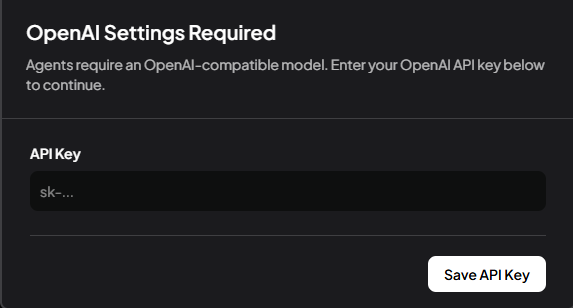
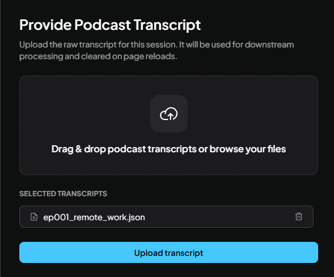
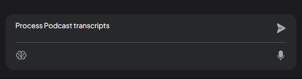
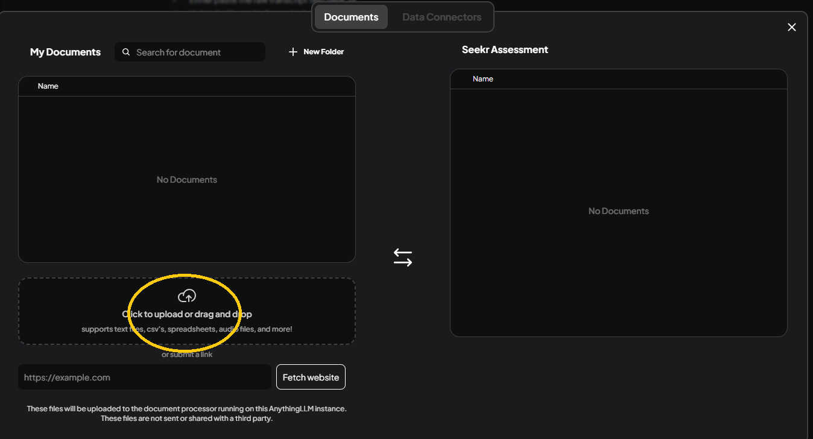
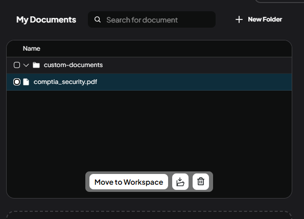
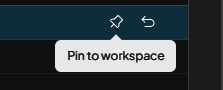

## Prerequisits

- Install [Nodejs](https://nodejs.org/en)
- Install Yarn (If you already have Nodejs installed, just run `corepack enable` in CLI)
- OpenAI API Key

## How to start app

#### via Docker Compose

1. In **docker/.env** file, declare OpenAI API key

```yaml
OPEN_AI_KEY='sk-...'
```

2. From root of this project, run `npm run docker-compose-up`

3. Once build is done, go to **http://localhost:3001** in browser.

#### via Local Development Server

1. In **server/.env** file, declare OpenAI API key

```yaml
OPEN_AI_KEY='sk-..'
```

2. Run command `npm run setup`

3. Run command `npm run dev:all`

4. Open **http://localhost:3000** in browser.

## How to use app

1. If you see this popup, please provide OpenAI API Key. You might see this popup time to time because the API key is not permanently saved anywhere.
   

2. Then you'll see this popup to upload Podcast transcripts. These uploads will be deleted on page refresh.


3. Select a transcript you wish to upload and click "Upload transcript" button.


4. Click on the "brain icon" at the bottom and choose model with high context. I recommend choosing **GPT-5** or above. Make sure to click "Use this model" button to save chosen model.


4. In the chat, type something that could trigger agent flow. You might have to try multiple different prompts for LLM to trigger pre-configured flow. Here are some examples prompts you can type:
- *Process Podcast transcripts utilizing flow_c6bef2ce-f82f-40cf-b9b8-7603ded6701c.*
- *Process the most recent Podcast uploads utilizing configured agent flow.*


5. If you expand the agent reasoning box, you can see all the steps it goes through. Server should also have some logs for you to view.


6. If something goes wrong, or you want to change uploaded transcripts, just refresh the page and start again. I made this I made the app the reload everything to simplify for this assessment.

## Optional Knowledge Base Uploads
You can also upload or even scrape knowledge base documents for better context for LLM to process. 

1. Click on upload button on the left panel


2. Click on **"Click to upload or drag and drop"** section and select whatever document you'd like to add.


3. Once uploaded, click on the uploaded document and click **"Move to Workspace"** button.


4. Then, click **"Save and Embed"** button on the right.


5. Make sure you pin the document to increase visibility of this document content for LLM.
