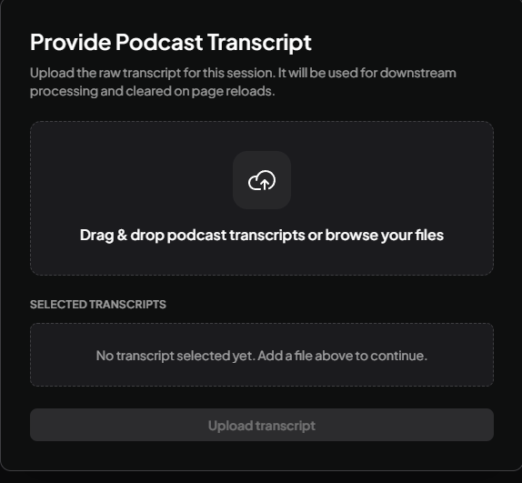
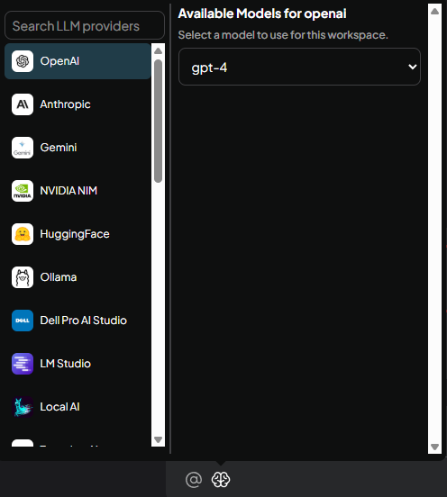
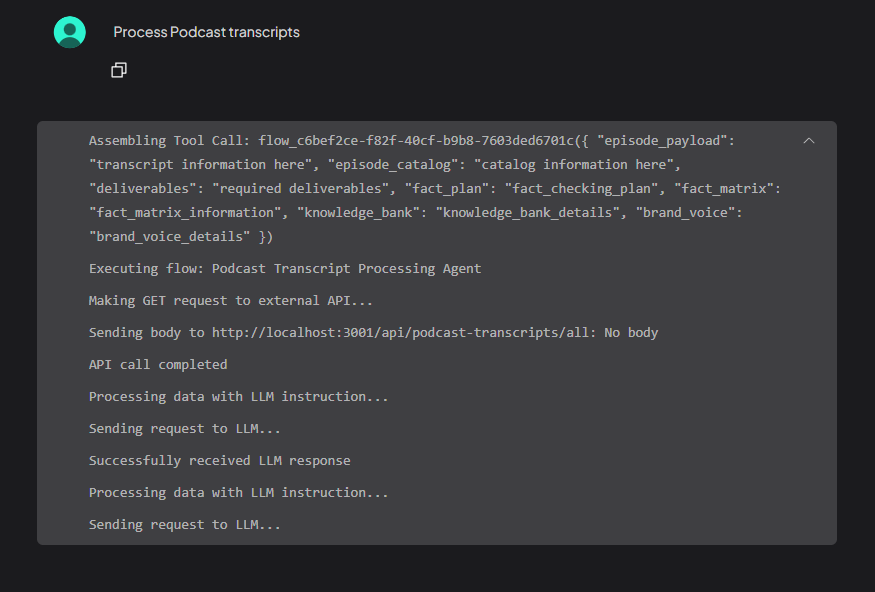
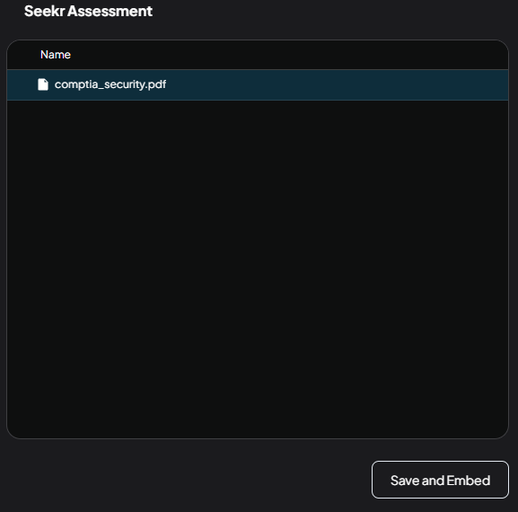
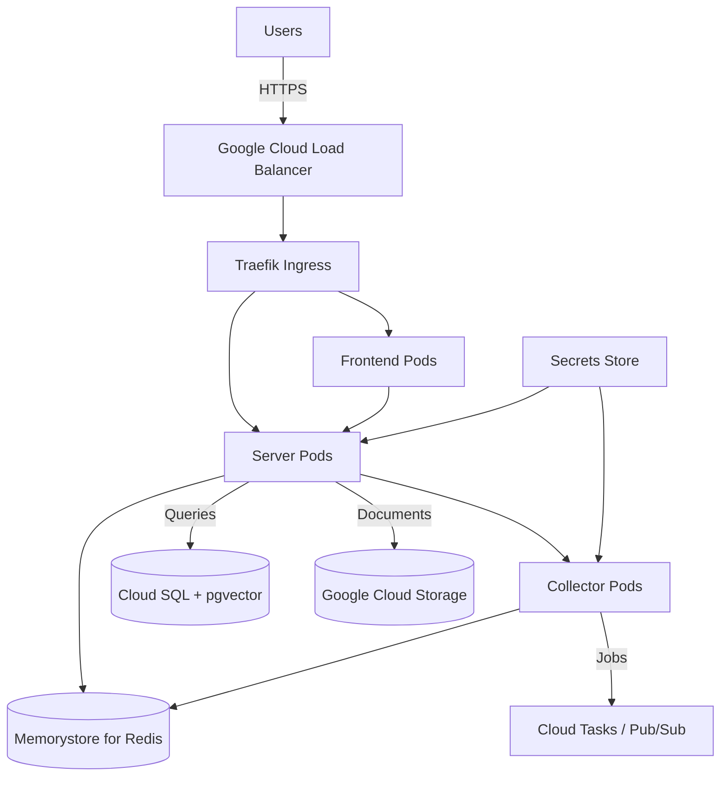

# Podcast Assessment Agent

Transform raw podcast transcripts into marketing-ready intelligence with a single agent flow. This project boots an AnythingLLM instance that forces the user to:

1. Provide an OpenAI-compatible API key (required for agent execution).
2. Upload podcast transcripts before the chat UI loads.
3. Trigger a pre-configured agent flow that cleans transcripts, generates summaries, extracts quotes, and performs a mock fact-check.

The repo already includes a working flow (`flow_c6bef2ce-f82f-40cf-b9b8-7603ded6701c`) aligned with the take-home assessment requirements.

---

## Table of Contents

1. [Prerequisites](#prerequisites)
2. [Quick Start](#quick-start)
   - [Run with Docker Compose](#run-with-docker-compose)
   - [Run with local Node/Yarn](#run-with-local-nodeyarn)
3. [Using the App](#using-the-app)
   - [Supplying the OpenAI Key](#supplying-the-openai-key)
   - [Uploading Podcast Transcripts](#uploading-podcast-transcripts)
   - [Triggering the Agent Flow](#triggering-the-agent-flow)
4. [Optional Knowledge-Base Uploads](#optional-knowledge-base-uploads)
5. [Troubleshooting](#troubleshooting)
6. [Deployment Strategy](#deployment-strategy)

---

## Prerequisites

- **Node.js ≥ 18** – only required for local development.
- **Yarn** – enable via `corepack enable` if you already have Node installed.
- **Docker & Docker Compose** – optional but recommended for the most reproducible setup.
- **OpenAI API Key (or compatible proxy)** – the agent flow requires an OpenAI-compatible chat model.

---

## Quick Start

### Run with Docker Compose

1. Edit `docker/.env` and set your OpenAI key:

   ```bash
   OPEN_AI_KEY='sk-your-key'
   ```

2. From the project root run:

   ```bash
   yarn docker-compose-up
   ```

3. Once the containers are healthy, open **http://localhost:3001** in a browser.

### Run with local Node/Yarn

1. Edit `server/.env` (or `server/.env.development`) and set:

   ```bash
   OPEN_AI_KEY='sk-your-key'
   ```

2. Install dependencies and wire up the monorepo:

   ```bash
   yarn setup
   ```

3. Start all services:

   ```bash
   yarn dev:all
   ```

4. Open **http://localhost:3000** in a browser.

---

## Using the App

### Supplying the OpenAI Key

On first load you will be blocked by an **OpenAI Settings** modal. The key is not persisted, so you may be prompted again after a hard refresh. Paste the key and click **Save API Key** to proceed.


### Uploading Podcast Transcripts

Immediately after the key modal closes, you’ll see the **Podcast Transcript Upload** dialog. Drag in one or more transcript files (plain text, JSON, DOCX, etc.) and click **Upload transcript**. The server wipes `server/storage/podcast-transcripts/` whenever the chat screen reloads, so re-upload if you refresh.


### Triggering the Agent Flow

1. Open the **brain** icon at the bottom, pick a high-context OpenAI model (GPT‑4o, GPT‑4.1, etc.), and click **Use this model**.
   
2. In the chat input field, try multiple different prompts until the pre-configured agent flow runs. Some example prompts are:

- `Process Podcast transcripts by triggering flow_c6bef2ce-f82f-40cf-b9b8-7603ded6701c`
- `Process uploaded Podcast transcripts`
  

3. Expand the agent reasoning panel to watch each step (normalization, summary, fact-check, Markdown assembly) or tail the server logs for structured output.
   

---

## Optional Knowledge-Base Uploads

Adding context improves the mock fact-check:

1. Click the upload icon in the left sidebar.
   
2. Use the drag-and-drop area to upload supporting docs (PDF, HTML, Markdown, etc.).
   
3. Move uploaded files into the active workspace by clicking **Move to Workspace** and then click **Save and Embed**.
   
   
4. Pin documents so the agent ranks them higher during RAG retrieval.
   

---

## Troubleshooting

| Symptom                                         | Likely Cause                                           | Fix                                                                                                  |
| ----------------------------------------------- | ------------------------------------------------------ | ---------------------------------------------------------------------------------------------------- |
| Agent outputs boilerplate summary               | Configured agent flow JSON not correctly parsed by LLM | Refresh the page and try again.                                                                      |
| “OpenAI API key must be provided to use agents” | Key is missing/expired                                 | Refresh the page and make sure to provide valid key. The key isn’t persisted upon container restart. |
| “Exceeded content limit”                        | Selected model has small context window                | Refresh the page and pick a higher-context model via the brain icon.                                 |

---

## Deployment Strategy

> **This is a high-level overview and would love to dive deeper if opportunity allows!**

### Architecture Overview



- **Compute** – Google Kubernetes Engine runs separate Deployments for `frontend`, `server`, and `collector`. Horizontal Pod Autoscalers watch CPU and queue metrics. Autopilot sizes nodes automatically. Standard mode keeps you in control when you need custom GPU or high-memory pools.
- **Data** – Cloud SQL for PostgreSQL with `pgvector` replaces SQLite/LanceDB. Use the managed primary/standby setup first and only explore sharding once a single database truly becomes a bottleneck.
- **Storage** – Google Cloud Storage holds transcript uploads, knowledge-bank files, and generated briefs. Turn on versioning and lifecycle policies to manage retention automatically.
- **Messaging** – Memorystore for Redis handles caching and short-lived queues, while Cloud Tasks or Pub/Sub drives longer-running agent jobs off the request path.
- **Networking** – Google Cloud Load Balancing forwards HTTPS traffic into the cluster. Traefik terminates TLS per hostname and routes requests. Internal services stay on private addresses.
- **Secrets** – Keep sensitive data secure by loading keys at runtime instead of baking them into images.

### Build & Release

- Containerize `frontend`, `server`, and `collector` with a shared Node base image to keep builds consistent.
- Publish Docker images and Helm charts to Google Artifact Registry (OCI).
- Use Google Cloud Build or GitHub Actions to lint, test, build, and push artifacts. Promote tagged releases through staging before production.
- Let Argo CD or Helmfile watch the registry and apply `helm upgrade` rollouts using blue/green or canary strategies.

### Scaling & Reliability

- Scale pods horizontally based on Cloud Monitoring metrics (CPU, queue backlog). Collector workers follow Redis or Cloud Tasks depth.
- Lean on Autopilot for automatic vertical sizing; Standard clusters add GPU or RAM-heavy pools when you need them.
- Offload long jobs to Cloud Tasks or Pub/Sub so user-facing pods stay responsive.
- Run regional GKE clusters across zones, add Pod Disruption Budgets, and keep readiness/liveness probes tuned so unhealthy pods restart quickly.
- Enable Cloud SQL HA, automated backups, and point-in-time recovery. Keep GCS versioning on for transcript recovery.

### Observability & Operations

- Capture metrics with Managed Prometheus (or OSS) and surface dashboards in Cloud Monitoring or Grafana.
- Centralize logs so they're searchable, and add basic alerts (e.g. email or Slack) when errors spike.
- Turn on request-level logging at the ingress or reverse proxy for traceability.
- Document clear steps for OpenAI key rotation, Helm rollbacks, transcript restores, and Cloud SQL failover.

### Security & Compliance

- Use mTLS inside the cluster so services authenticate each other before exchanging data.
- Limit who can reach admin tooling by combining simple firewall rules with IAM restrictions.
- Keep Cloud SQL and Memorystore private using VPC Service Controls, Private Service Connect, and firewall policies.
- Keep IAM tight so each service only has the access it needs. Rotate secrets routinely. Bake Trivy (images) and Semgrep (code) scans into CI/CD.

### Cost Management

- Autopilot right-sizes pods but bills per vCPU/GB, while Standard clusters can mix on-demand and Spot nodes for worker jobs.
- Apply GCS lifecycle rules to archive or drop stale transcripts and watch Cloud SQL disk auto-scaling.
- Track spend with budgets and quota alerts for OpenAI usage, GKE resources, and Cloud SQL consumption.
- Schedule scale-down windows (KEDA or CronJobs) to trim replicas during predictable quiet hours.
